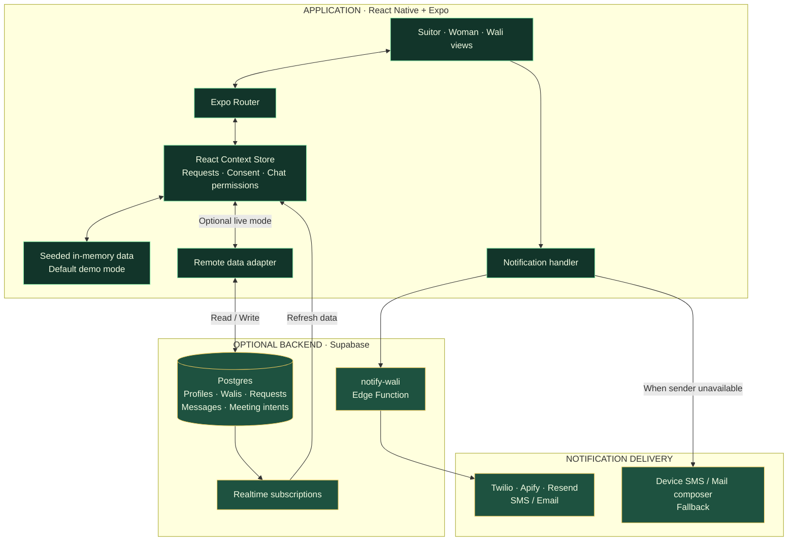

<h1 align="center">💍 Khitbah</h1>

  <strong>Intent. Consent. Family.</strong> 
  A considered path to marriage for the Western Muslim diaspora.

  
  
  
  

---

## Why we built it

Finding a spouse should bring clear intentions, family involvement, and personal choice together.

We built **Khitbah** as a marriage-app prototype designed around Sharia-compliant courtship. Wali involvement begins with the first introduction, and the woman's consent remains a separate, essential step.

## The journey

**Introduction → Wali approval → Her acceptance → Shared conversation → Mutual agreement to meet → Wali handoff**

Either approval stage can end with a decline. A conversation opens only after both gates are passed.

## What makes Khitbah different

| Principle | The experience |
| --- | --- |
| **Wali involvement from the start** | Introduction requests reach the wali before the woman. |
| **Her consent, always** | She independently accepts or declines after wali approval. |
| **Shared conversations** | The suitor, woman, and wali can access the conversation. The wali can always read; she decides whether he can write. |
| **A purposeful next step** | Both members of the couple must agree to meet before coordination passes to the wali. |

The MVP also includes profile discovery, role-specific inboxes, profile controls, and optional SMS or email notifications.

## System design

The core demo runs locally. Connecting Supabase adds persistence and updates across devices. Notifications use a separate delivery path, with an optional demo-only client Apify email fallback before the device composer.

## Built with

**React Native + Expo** for mobile and web · **TypeScript** for application logic · **Expo Router** for navigation · **React Context** for state · **Supabase** for optional persistence, live updates, and notification functions.

The visual identity pairs forest green, cream, mint, and gold with IBM Plex typography.

## Try the journey

Switch between **Yusuf**, **Maryam**, and **Imran** using **Settings → Viewing as** to experience the suitor, woman, and wali perspectives on one device.

**Send a request → approve as wali → accept as woman → open Messages → agree to meet.**

## Project status

Built during a **24-hour hackathon**. The default demo uses seeded, in-memory data; Supabase optionally enables shared data across devices.

Authentication, secure production permissions, and identity verification are not implemented. The prototype is intended for demo data.

---

  <strong>💍 Khitbah — Intent. Consent. Family.</strong> 
  <a href="LICENSE">MIT License</a>

